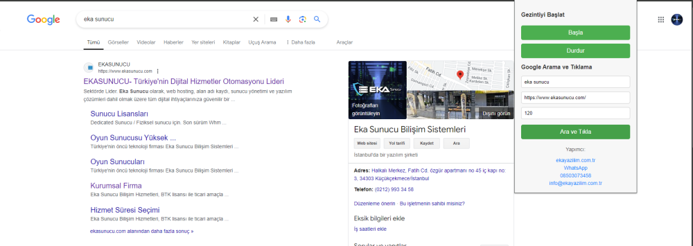

# Google Chrome Otomatik Web Gezinme ve Tıklama Eklentisi

Bu uzantı, belirli web sayfalarında otomatik gezinme, menüler arasında dolaşma, Google arama sonuçlarında belirtilen bir siteyi bulma ve tıklama işlemlerini gerçekleştirmek için geliştirilmiştir.

## Özellikler

- **Otomatik Menü Gezinme:**
  - Uzantı, bir web sayfasındaki menü bağlantılarını otomatik olarak tıklayarak, menü öğeleri arasında dolaşır. Her menü tıklamasından sonra sayfa aşağıya kaydırılır ve ardından yukarı çıkılır. Bu işlem, tüm menü öğeleri için tekrarlanır.
- **Durdurma İşlevi:**
  - Gezinme işlemleri sırasında istediğiniz zaman durdurma işlevini kullanabilirsiniz. "Durdur" butonuna tıklayarak mevcut işlemleri durdurabilirsiniz.
- **Google Arama ve Tıklama:**
  - Uzantı, belirli bir anahtar kelimeyi Google'da arayabilir ve belirtilen siteyi sonuçlar arasında bulduğunda siteye tıklayabilir. Eğer site ilk sayfada bulunamazsa, uzantı otomatik olarak bir sonraki sayfaya geçer ve aramaya devam eder.
  - Siteye tıklanıp geçildiğinde, sayfada belirtilen süre boyunca kalır.
- **Manuel Müdahale Gerektirmeyen İşlemler:**
  - Uzantı, belirli görevleri tamamen otomatik hale getirir. Kullanıcının müdahale etmesine gerek kalmadan menülerde gezinir, sayfada aşağı yukarı kaydırır ve Google sonuçlarında tıklamalar gerçekleştirir.
- **Dinamik URL Yönlendirmeleri:**
  - Hedef siteye ulaşıldığında, otomatik olarak o sayfaya yönlendirilir ve belirli bir süre boyunca sayfada kalınır.

## Kullanım Alanları

- **SEO Testleri:** Web sitenizin Google arama sonuçlarındaki yerini bulmak ve tıklanma oranlarını test etmek için kullanabilirsiniz.
- **Otomatik İçerik İncelemeleri:** Bir web sitesindeki menülerin içeriğini otomatik olarak gezebilir ve sayfa yapısını kontrol edebilirsiniz.
- **Web Trafiği İzleme:** Otomatik olarak belirli sitelere trafik göndermek için kullanılabilir.

## Ekran Görüntüsü

## Nasıl Kullanılır?

### Başlat/Durdur:
Uzantıyı etkinleştirmek için "Başla" butonuna tıklayın. Durdurmak istediğinizde "Durdur" butonunu kullanın.

### Google Arama ve Tıklama:
Google’da aramak istediğiniz anahtar kelimeyi girin, tıklanacak site URL’sini belirtin ve sayfada ne kadar süre kalması gerektiğini belirleyin. Son olarak "Ara ve Tıkla" butonuna tıklayın.

Bu uzantı, özellikle belirli görevleri otomatikleştirmek isteyen kullanıcılar için idealdir. Manuel işlemleri en aza indirerek zaman kazandırır ve tekrarlayan görevleri hızlı bir şekilde gerçekleştirir.

## Kurulum Talimatları

### 1. Adım: Uzantı Dosyalarını Hazırlayın
Öncelikle, uzantıyı oluşturmak için gerekli dosyaları bir klasörde toplamanız gerekmektedir. Aşağıdaki dosyalar bu klasör içerisinde bulunmalıdır:

- `manifest.json`
- `popup.html`
- `popup.js`
- `content.js`
- `background.js` (Eğer gerekiyorsa)

Bu dosyalar, uzantınızın çalışması için gerekli tüm yapı taşlarını oluşturur.

### 2. Adım: Geliştirici Modunu Etkinleştirin
- Google Chrome tarayıcınızı açın.
- Adres çubuğuna `chrome://extensions/` yazın ve Enter'a basın.
- Sağ üst köşede bulunan Geliştirici Modu (Developer Mode) anahtarını etkinleştirin.

### 3. Adım: Uzantıyı Yükleyin
- Geliştirici Modu etkinleştirildikten sonra, sayfanın sol üst köşesinde **Paketlenmemiş Yükle (Load unpacked)** butonunu göreceksiniz.
- Bu butona tıklayın ve uzantınızın dosyalarının bulunduğu klasörü seçin.
- Chrome, bu klasörü kullanarak uzantıyı yükleyecektir.

### 4. Adım: Uzantıyı Test Edin
- Uzantı yüklendikten sonra, Chrome tarayıcınızın sağ üst köşesinde uzantı ikonunu göreceksiniz.
- İkona tıklayarak uzantıyı açın ve "Başla" ya da "Ara ve Tıkla" butonlarına tıklayarak işlevlerini test edin.
- Eğer uzantı beklenildiği gibi çalışmıyorsa, dosyalarınızı gözden geçirin ve hataları düzeltin.

### 5. Adım: Uzantıyı Kullanın
- Uzantıyı başarıyla yükledikten sonra, menüler arasında otomatik gezinmek veya Google arama sonuçlarında belirtilen siteye tıklamak gibi işlemleri kolayca gerçekleştirebilirsiniz.
- Uzantının özelliklerini tam anlamıyla kullanmak için ilgili butonları kullanarak belirli görevleri başlatabilir veya durdurabilirsiniz.

### 6. Adım: Uzantıyı Kaldırın (İsteğe Bağlı)
- Uzantıyı kaldırmak isterseniz, `chrome://extensions/` sayfasına geri dönün.
- Yüklediğiniz uzantının altında bulunan **Kaldır (Remove)** butonuna tıklayın.

## İletişim

Bu uzantı hakkında daha fazla bilgi almak için [Eka Sunucu](https://www.ekasunucu.com/yazilim/google-chrome-otomatik-web-gezinme-ve-tiklama-eklentisi) sayfasını ziyaret edebilirsiniz.

Yazılım çözümleri ve diğer projeler hakkında daha fazla bilgi almak için [Eka Sunucu](https://www.ekasunucu.com/) ve [Eka Yazılım](https://ekayazilim.com.tr) sitelerine göz atabilirsiniz.

VDS hizmetleri için [VDS Satın Al](https://www.ekasunucu.com/kategori/turkiye-lokasyon-vds-vps) sayfasını, WordPress hosting için ise [WordPress Hosting](https://www.ekasunucu.com/kategori/wordpress-hosting) sayfasını ziyaret edebilirsiniz.

İletişim:  
E-posta: [info@ekayazilim.com.tr](mailto:info@ekayazilim.com.tr)  
Telefon: 0850 307 34 58
